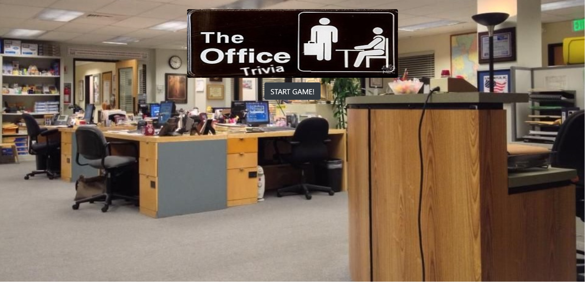
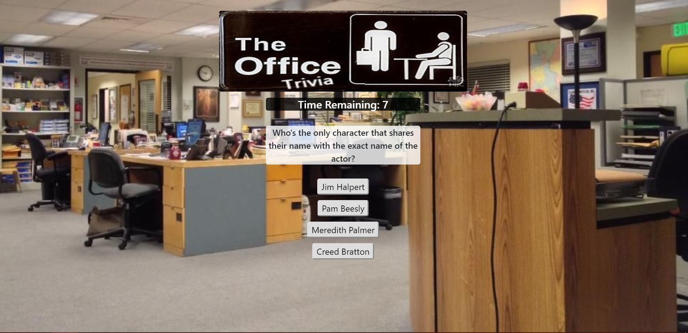
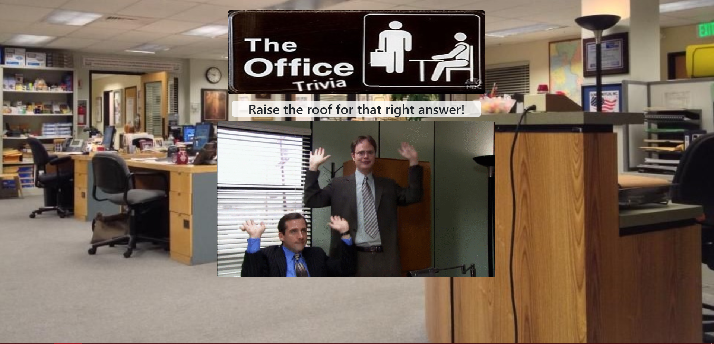
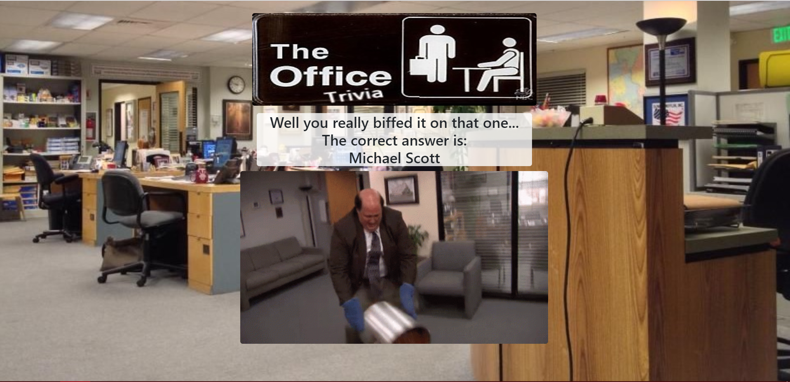
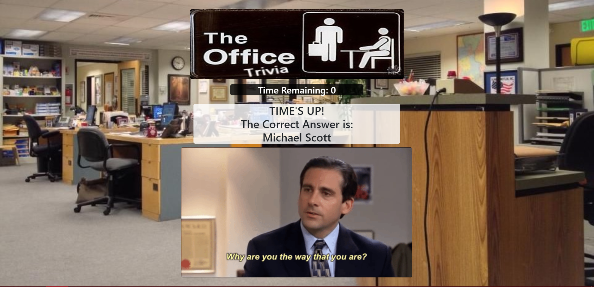
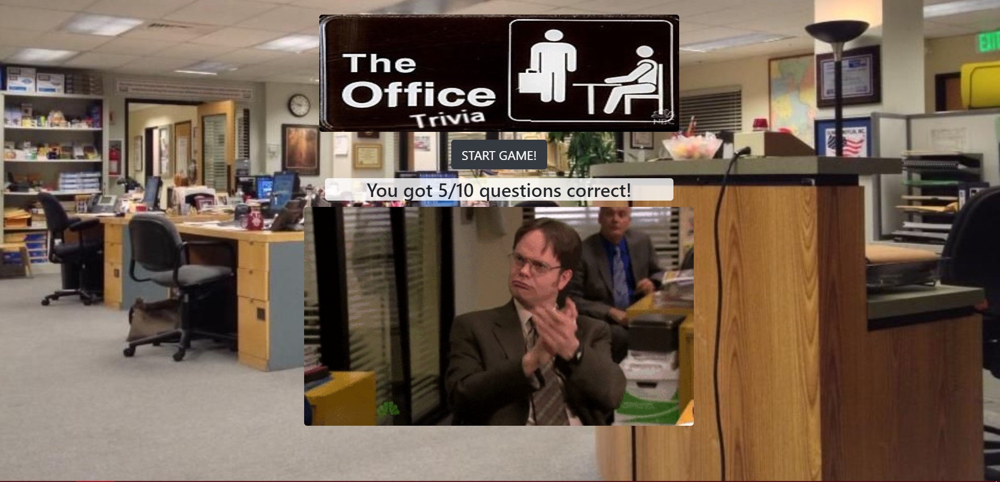

# TriviaGame

I've created a "The Office" themed trivia game that shows only one question at a time until the player answers it or their time runs out.

If the player selects the correct answer, a screen congratulating them for choosing the right option shows with a fun gif. After a few seconds, the next question is displayed without user input.

Same thing happens with wrong answers and time-outs but with unique messages, the correct answer displayed, and gifs.

Once all questions are answered, the final screen shows the number of correct answers out of total questions, and an specific gif based on how many correct answers the player got. An option to restart the game (without reloading the page) is also displayed.  Questions restart in the same order.

Play the game [here](https://bdelong.github.io/TriviaGame/)